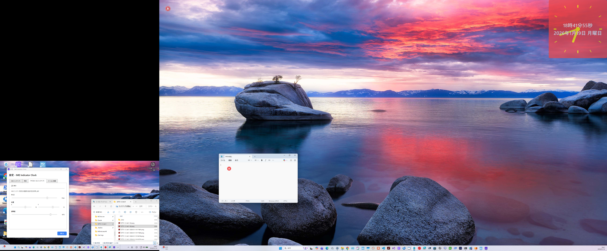
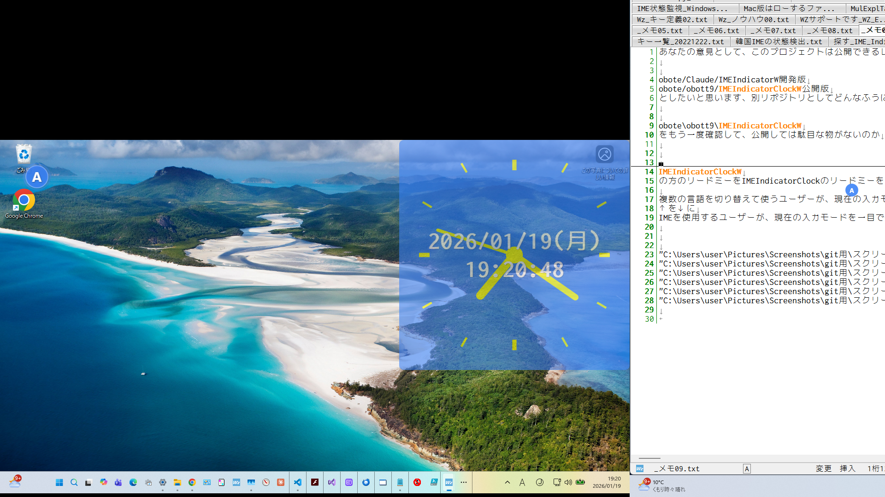
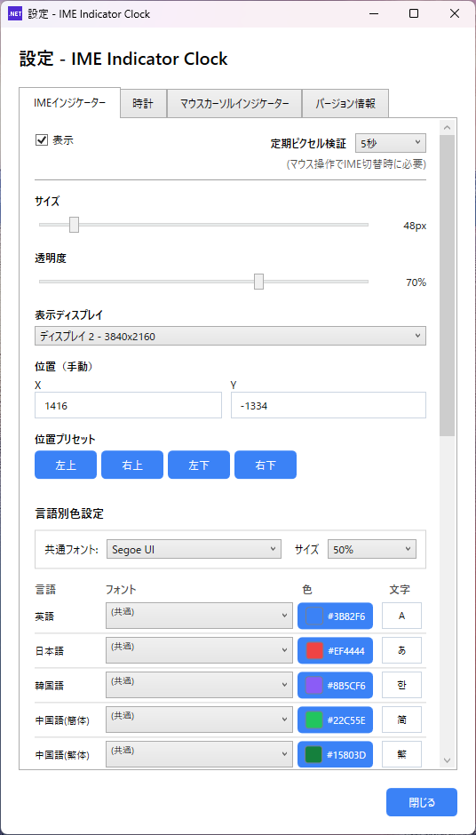
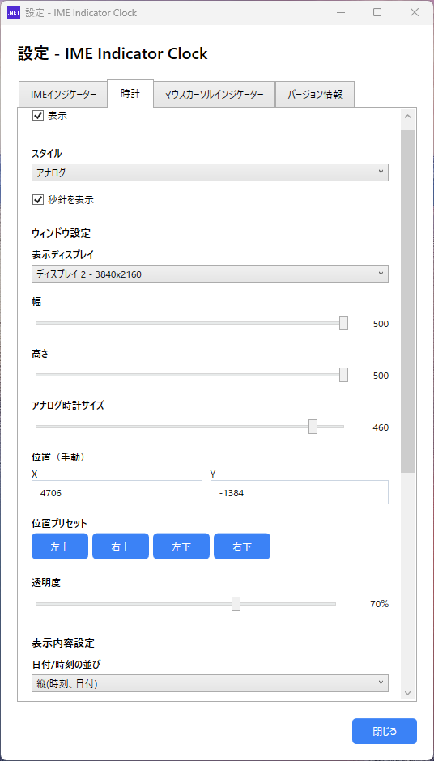
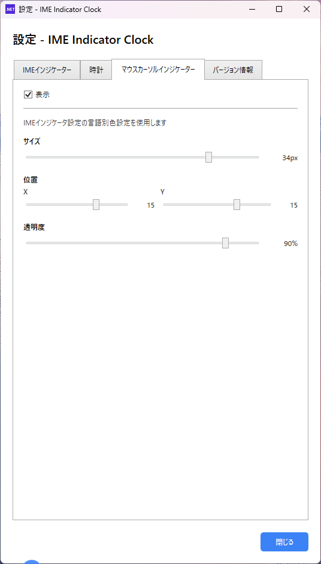
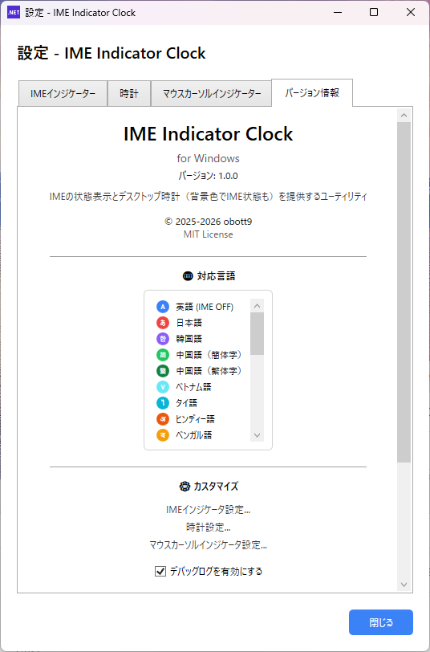

# IMEIndicatorClockW

[English](README.md) | [繁體中文](README_zh-Hant.md) | [简体中文](README_zh-Hans.md) | [한국어](README_ko.md)

IME（入力メソッドエディタ）の状態とカスタマイズ可能なデスクトップ時計を視覚的に表示するWindowsユーティリティアプリです。

macOS版 [IMEIndicatorClock](https://github.com/obott9/IMEIndicatorClock) のWindows移植版です。

## スクリーンショット

### デスクトップ表示
| IME ON（日本語入力） | IME OFF（英語入力） |
|:-------------------:|:-------------------:|
|  |  |

### 設定画面
| IMEインジケータ | 時計 | マウスカーソル | バージョン |
|:--------------:|:----:|:-------------:|:---------:|
|  |  |  |  |

## ビジョン

**目標は、世界中のIMEに対応すること。**

IMEを使用するユーザーが、現在の入力モードを一目で確認できるようにすることを目指しています。

## 機能

### IMEインジケータ
- 入力メソッド（IME）の状態を画面上に視覚的に表示

| 日本語 | 韓国語 | 中国語（繁体字） | 中国語（簡体字） | 英語 |
|:------:|:------:|:---------------:|:---------------:|:----:|
|  |  |  |  |  |
| 赤「あ」 | 紫「가」 | 濃緑「繁」 | 緑「简」 | 青「A」 |

- 表示位置、サイズ、背景色、フォント、フォント色、透明度をカスタマイズ可能
- マルチディスプレイ対応

### デスクトップ時計
- アナログ/デジタル両対応のフローティング時計
- 日付表示対応（和暦対応）
- IME状態に応じた背景色切り替え機能
- ウィンドウサイズ、フォントサイズ、色を自由にカスタマイズ

### マウスカーソルインジケータ
- マウスカーソル付近にIME状態を表示
- IMEインジケータを小さく表示
- テキスト入力時に便利

### 自動起動
- Windows起動時に自動でアプリを起動（タスクスケジューラ使用）
- トレイアイコンのメニューから有効/無効を切り替え
- 自動起動を有効にした後にEXEを移動した場合は再設定が必要

### 管理者権限について
- このアプリは管理者権限で実行されます
- タスクマネージャー等の管理者権限で起動したアプリでもIME状態を正しく検出するために必要です

## 言語サポート

### 完全対応（IME検出 + UI）
| 言語 | IME検出 | UI翻訳 |
|------|:-------:|:------:|
| 日本語 | ✅ | ✅ |
| 英語 | ✅ | ✅ |
| 中国語（簡体字） | ✅ | ✅ |
| 中国語（繁体字） | ✅ | ✅ |
| 韓国語 | ✅ | ✅ |

### IME検出 + 基本UI
| 言語 | IME検出 | UI翻訳 |
|------|:-------:|:------:|
| タイ語 | ✅ | ✅ |
| ベトナム語 | ✅ | ✅ |
| アラビア語 | ✅ | ✅ |
| ヘブライ語 | ✅ | ✅ |
| ヒンディー語 | ✅ | ✅ |
| ロシア語 | ✅ | ✅ |
| ギリシャ語 | ✅ | ✅ |
| ベンガル語 | ✅ | ✅ |
| タミル語 | ✅ | ✅ |
| テルグ語 | ✅ | ✅ |
| ネパール語 | ✅ | ✅ |
| シンハラ語 | ✅ | ✅ |
| ミャンマー語 | ✅ | ✅ |
| クメール語 | ✅ | ✅ |
| ラオ語 | ✅ | ✅ |
| モンゴル語 | ✅ | ✅ |
| ペルシャ語 | ✅ | ✅ |
| ウクライナ語 | ✅ | ✅ |

*これらの言語のUI翻訳は機械翻訳のため、改善が必要な場合があります。貢献歓迎！*

## 動作環境

- Windows 10/11
- 追加ランタイム不要（単体で動作）

## インストール

1. [Releases](https://github.com/obott9/IMEIndicatorClockW/releases) から最新版をダウンロード
2. 任意のフォルダに展開
3. `IMEIndicatorClockW.exe` を実行

### Vector からダウンロード

- [Vector](https://www.vector.co.jp/soft/winnt/writing/se528405.html)

## ソースからビルド

### 必要環境
- Visual Studio 2022 または VS Code
- .NET 8.0 SDK

### ビルド手順
```bash
git clone https://github.com/obott9/IMEIndicatorClockW.git
cd IMEIndicatorClockW
dotnet build
```

## 使い方

1. アプリを起動するとシステムトレイにアイコンが表示されます
2. トレイアイコンを右クリックで設定にアクセスできます
3. 時計やインジケータはドラッグで好きな位置に移動できます
4. 自動起動は、トレイアイコンのメニューから「Windows起動時に開始」を選択

## アンインストール

1. 自動起動を有効にしている場合は、先にメニューから無効にしてください
2. 展開したフォルダを削除
- レジストリは使用していません
- 設定ファイルは `%AppData%\IMEIndicatorClockW` に保存されています（完全削除する場合はこのフォルダも削除）

## セキュリティ・プライバシーについて

### キーボードフックの使用について

本アプリケーションは、IME状態の正確な検出のために**低レベルキーボードフック**（`SetWindowsHookEx` API）を使用しています。

**なぜキーボードフックが必要か：**
- Windows標準のIME APIだけでは、一部のアプリケーション（ターミナル、ゲームなど）でIME状態を正確に取得できません
- キーボードフックにより、IME切り替えキー（半角/全角、変換キーなど）の押下を検出し、より正確な状態表示を実現しています

**安全性について：**
- キー入力の内容は**一切記録・送信しません**
- 検出するのはIME関連のキー（半角/全角、Ctrl+Space等）のみです
- インターネット通信機能はありません
- 設定データはローカル（`%AppData%\IMEIndicatorClockW`）にのみ保存されます
- ソースコードは公開されており、動作を確認できます

**ウイルス対策ソフトの警告について：**
キーボードフックを使用するアプリケーションは、ウイルス対策ソフトから警告を受ける場合があります。これはキーロガー等と同じ技術を使用しているためですが、本アプリケーションは悪意のある動作を行いません。ご心配な場合はソースコードをご確認ください。

## 開発

このプロジェクトは Anthropic の [Claude AI](https://claude.ai/) との共同作業で開発されました。

Claudeは以下をサポートしました：
- アーキテクチャ設計とコード実装
- 多言語ローカライズ
- ドキュメントとREADMEの作成

## サポート

このアプリが役に立ったら、コーヒーをおごってください！

[](https://ko-fi.com/obott9)

## 貢献

貢献を歓迎します！特に：
- 追加言語のUI翻訳
- より多くのIMEタイプのサポート
- バグ報告と機能リクエスト

## ライセンス

MIT License - 詳細は [LICENSE](LICENSE) ファイルを参照してください。
